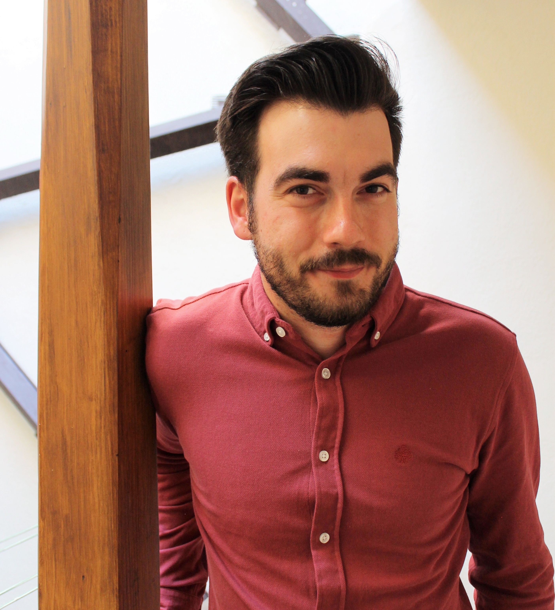

Welcome to my website!  Since 2019 I am Assistant Professor in Methodology at the Autonomous University of Madrid. On this website you can find information about my research projects and the software I have developed. You can contact me on: miguel.sorrel@uam.es. Also check out my Github site! Here is the hexsticker for the cdcatR package.

|   |   |
|---|---|
| {width=50%}| {width=25%} |

#### NEWS!
We have sent several papers to the EAM congress organized in Ghent (Belgium) that will be held from July 11 to 13. We are also presenting a paper in a virtual session of NCME this March. 

https://eam2023.ugent.be/

https://www.ncme.org/home 

