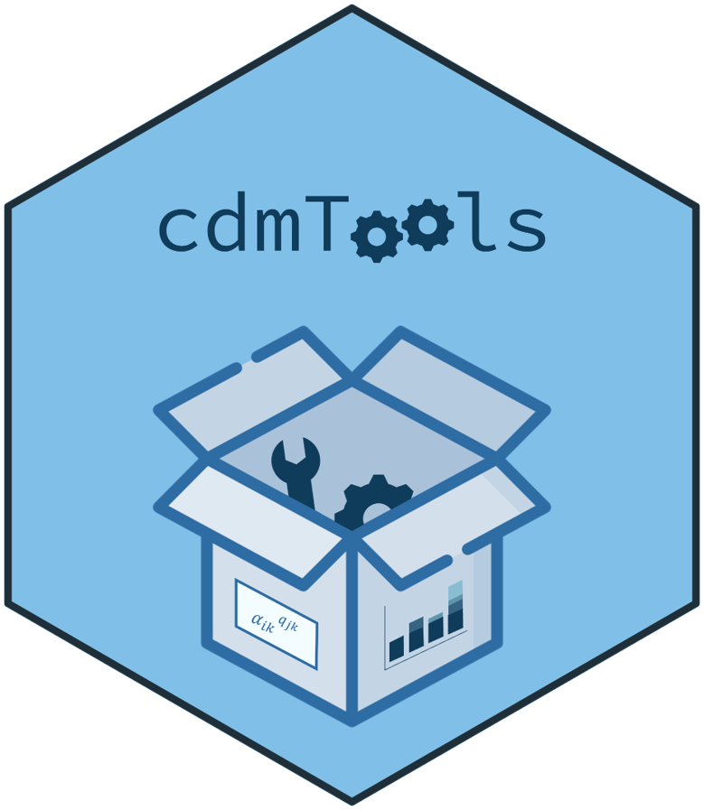
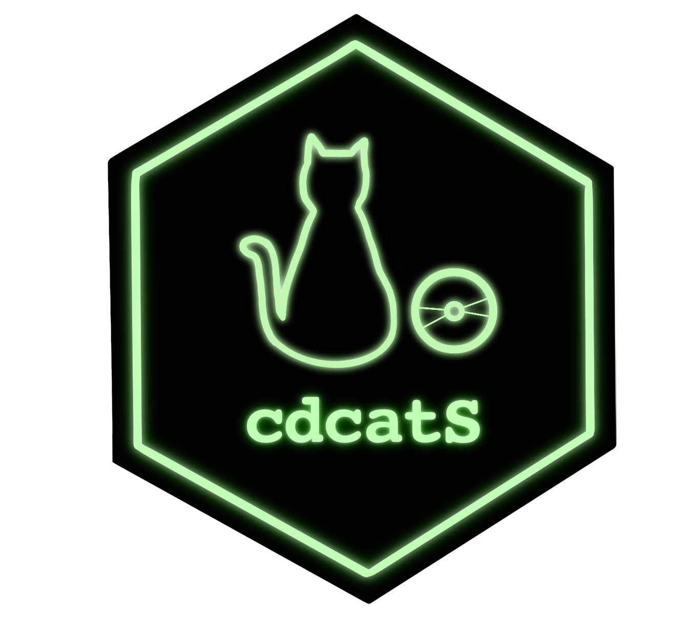

# Research Projects  

### 1. **Computerized adaptive tests based on new assessment formats**  
- **Role**: Co-Principal Investigator (with Francisco J. Abad)  
- **Timeline**: 01/09/2023 – 31/08/2027  
- **Funding**: €37,675, funded by the Spanish Ministry of Science and Innovation (Reference PID2022-137258NB-I00)  

**Research Team**: Jimmy de la Torre, Pablo Nájera, Rodrigo S. Kreitchmann, María D. Nieto, Francisco J. Román, Iwin Leenen, Marcos Jiménez-Hernández, and Luis E. Garrido.

---

### 2. **Study of statistical procedures for diagnostic evaluation in educational contexts**  
- **Role**: Principal Investigator  
- **Timeline**: 01/01/2022 – 31/12/2023  
- **Funding**: €7,358.66, funded by the Community of Madrid through the Pluriannual Agreement with the Universidad Autónoma de Madrid in its Programa de Estímulo a la Investigación de Jóvenes Doctores (Reference SI3/PJI/2021-00258)  

**Research Team**: Francisco J. Abad, Jimmy de la Torre, Pablo Nájera, and Rodrigo S. Kreitchmann.

---

# Software  

## R Packages  

#### 1. **cdcatR**  

<table style="width: 100%; border-collapse: collapse;">
  <tr>
    <td style="width: 50%; padding: 20px; vertical-align: top;">
      
Role: <strong>Creator, Maintainer</strong>

      
Description: An R package for cognitive diagnostic computerized adaptive testing.

      

    </td>
    <td style="width: 50%; text-align: left; padding: 0;">

</td>
  </tr>
</table>

**Citation**: Sorrel, M. A., Nájera, P., & Abad, F. J. (2022). *cdcatR: Cognitive Diagnostic Computerized Adaptive Testing*. R package version 1.0.6. [CRAN](https://CRAN.R-project.org/package=cdcatR)

**Tutorial**: Sorrel, M. A., Nájera, P., & Abad, F. J. (2021). cdcatR: An R Package for Cognitive Diagnostic Computerized Adaptive Testing. *Psych*, 3(4), 386–403. [DOI](https://doi.org/10.3390/psych3030028)

---

#### 2. **cdmTools**  

<table style="width: 100%; border-collapse: collapse;">
  <tr>
    <td style="width: 50%; padding: 20px; vertical-align: top;">
      
Role: <strong>Creator</strong>

      
Description: Useful tools for cognitive diagnosis modeling.

      

    </td>
    <td style="width: 50%; text-align: left; padding: 0;">

</td>
  </tr>
</table>

**Citation**: Nájera, N., Sorrel, M. A., & Abad, F. J. (2022). *cdmTools: Useful Tools for Cognitive Diagnosis Modeling*. R package version 1.0.5. [CRAN](https://CRAN.R-project.org/package=cdmTools)

---

### 3. **GDINA**  

<table style="width: 100%; border-collapse: collapse;">
  <tr>
    <td style="width: 50%; padding: 20px; vertical-align: top;">
      
Role: <strong>Contributor</strong>

      
Description: An R package for cognitive diagnosis modeling in the generalized DINA model framework.

      

    </td>
<!--     <td style="width: 50%; text-align: left; padding: 0;"> -->
<!--  -->
</td>
  </tr>
</table>

**Citation**: Ma, W. & de la Torre, J. (2020). GDINA: An R Package for Cognitive Diagnosis Modeling. *Journal of Statistical Software*, *93*(14), 1–26. [DOI](https://doi.org/10.18637/jss.v093.i14)
**Tutorial**: Shi, Q., Ma, W., Robitzsch, A., Sorrel, M. A., & Man, K. (2021). Cognitively diagnostic analysis using the G-DINA model in R. *Psych*, 3(4), 812-835. [DOI](https://doi.org/10.3390/psych3040052)

---

## Computer Programs and Apps  

### 1. **FoCo**  

<table style="width: 100%; border-collapse: collapse;">
  <tr>
    <td style="width: 80%; padding: 20px; vertical-align: top;">
      
Role: <strong>Creator, Maintainer, Project Coordinator</strong>

        
Link: [FoCo App](https://psychometricmodelling.shinyapps.io/FoCo/)

      
Description: A Shiny app for formative assessment and self-evaluation of competencies. Traditional educational assessment has been focused almost exclusively on rank-odering (e.g., Student A < Student B < Student C). Formative assessment aims to provide specific feedback to facilitate remedial instruction (e.g., Student A masters competency 1, but not 2 and 3; Student B masters competencies 1 and 2, but not 3…). To facilitate these applications we generated a Shinny app that allow for cognitive diagnosis modeling applications. 

    </td>
    <td style="width: 20%; text-align: left; padding: 0;">

</td>
  </tr>
</table>

**Citation and tutorial**: Sanz, S., Kreitchmann, R. S., Nájera, P., Moreno, J. D., Martínez-Huertas, J. Á., & Sorrel, M. A. (2023). FoCo: A Shiny app for formative assessment using cognitive diagnosis modeling. *Psicología Educativa*, *29*(2), 149-158. [DOI](https://CRAN.R-project.org/package=cdcatR)

---

### 2. **cdcatS**  

<table style="width: 100%; border-collapse: collapse;">
  <tr>
    <td style="width: 80%; padding: 20px; vertical-align: top;">
      
Role: <strong>Co-Author</strong>

      
Link: [cdcatS App](https://psychometricmodelling.shinyapps.io/cdcatS/) 

      
Description: A Shiny app for nonparametric CD-CAT implementations.   

    </td>
    <td style="width: 20%; text-align: left; padding: 0;">

</td>
  </tr>
</table>

---

### 3. **FCoptimization**  

<table style="width: 100%; border-collapse: collapse;">
  <tr>
    <td style="width: 80%; padding: 20px; vertical-align: top;">
      
Role: <strong>Co-Author</strong>

        
Link: [FCoptimization App](https://psychometricmodelling.shinyapps.io/FCoptimization/)

      
Description: A genetic algorithm for optimizing pairwise forced-choice questionnaires. 

<!--     </td> -->
<!--     <td style="width: 20%; text-align: left; padding: 0;"> -->
<!--  -->

<!-- </td> -->
  </tr>
</table>

**Citation**: Kreitchmann, R. S., Abad, F. J., & Sorrel, M. A. (2021). A Genetic Algorithm for Optimal Assembly of Pairwise Forced-Choice Questionnaires. *Behavior Research Methods*. [DOI](https://doi.org/10.3758/s13428-021-01677-4)

