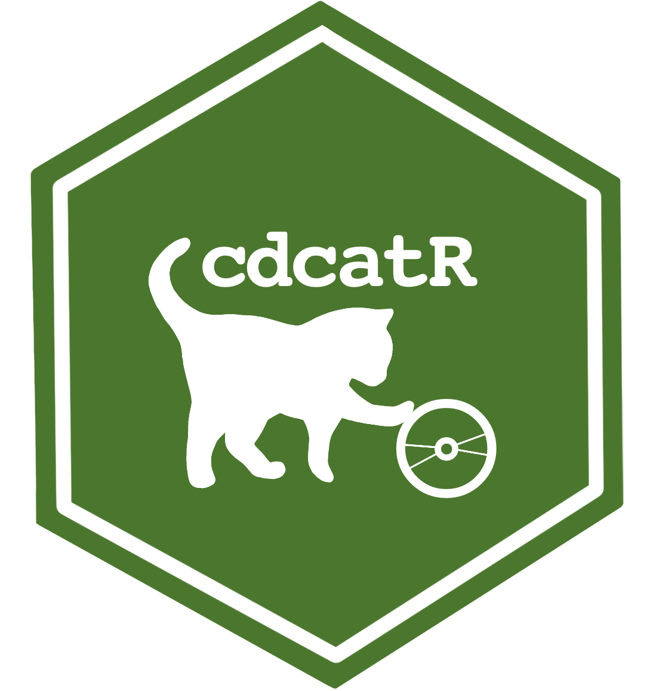

## [Research Projects] 

* **Computerized adaptive tests based on new assessment formats**. Co-Principal Investigator (with Francisco J. Abad). (01/09/2023 - 31/08/2027. €37,675)

Research Team: Jimmy de la Torre, Pablo Nájera, Rodrigo S. Kreicthmann, María D. Nieto, Francisco J. Román, Iwin Leenen, Marcos Jiménez-Hernández, and Luis E. Garrido. This work has been funded by the Spanish Ministry of Science and Innovation (Reference PID2022-137258NB-I00).

* **Study of statistical procedures for diagnostic evaluation in educational contexts**. Principal Investigator. (01/01/2022 - 31/12/2023. €7,358.66)

Research Team: Francisco J. Abad, Jimmy de la Torre, Pablo Nájera, and Rodrigo S. Kreicthmann. This work has been funded by the Community of Madrid through the Pluriannual Agreement with the Universidad de Universidad Autónoma de Madrid in its Programa de Estímulo a la Investigación de Jóvenes Doctores (Reference SI3/PJI/2021-00258).

## [Software] 

#### [R Packages] 

* **cdcatR** creator, maintainer

|   |   |   |   |   |   |
|---|---|---|---|---|---|
 |   |  |  |

Citation:
Sorrel, M. A., Nájera, N., & Abad, F. J. (2022). *cdcatR: Cognitive Diagnostic Computerized Adaptive Testing*. R package version 1.0.6. Retrived from <https://CRAN.R-project.org/package=cdcatR>

Tutorial:
Sorrel, M. A., Nájera, P., & Abad, F. J. (2021). cdcatR: An R Package for Cognitive Diagnostic Computerized Adaptive Testing. *Psych*, 3(4), 386-403. https://doi.org/10.3390/psych3030028

{width=15%}

* **cdmTools** creator

|   |   |   |   |   |   |
|---|---|---|---|---|---|
 |   |  |  |

Citation:
Nájera, N., Sorrel, M. A., & Abad, F. J. (2022). *cdmTools: Useful Tools for Cognitive Diagnosis Modeling*. R package version 1.0.2. Retrived from <https://CRAN.R-project.org/package=cdcatR>

{width=15%}

* **GDINA** contributor

|   |   |   |   |   |   |
|---|---|---|---|---|---|
 |   |  |  |

Citation:
Ma, W. & de la Torre, J. (2020). GDINA: An R Package for Cognitive
Diagnosis Modeling. *Journal of Statistical Software*, *93*(14), 1-26.
<https://doi.org/10.18637/jss.v093.i14>

Ma, W. & de la Torre, J. (2022).*GDINA: The generalized DINA model framework*. R package version 2.8.8. Retrived from https://CRAN.R-project.org/package=GDINA

Tutorial:
Shi, Q., Ma, W., Robitzsch, A., Sorrel, M. A., Man, K. (2021). Cognitive diagnosis analysis in the G-DINA model using R. *Psych*, 3(4), 812-835. https://doi.org/10.3390/psych3040052

* **psychbootcamp** creator, maintainer

Citation:
Sorrel, M.A., & Nájera, P. (2023). *psychbootcamp: Datasets and challenges to learn Psychometrics in R*. R package version 0.1.0. <https://github.com/miguel-sorrel/psychbootcamp>

Innovation Project PS_003.22_INN and PS_004.23_IMP supported by UAM. Other team members are: Francisco Jose Abad,  Carmen García, and Agustín Martínez-Molina.

#### [Computer programs and Apps] 

* **FoCo: A Shiny App for Formative Assessment and Self-Evaluation of Competencies**, creator, maintainer, project coordinator

Traditional educational assessment has been focused almost exclusively on rank-odering (e.g., Student A < Student B < Student C). Formative assessment aims to provide specific feedback to facilitate remedial instruction (e.g., Student A masters competency 1, but not 2 and 3; Student B masters competencies 1 and 2, but not 3…). To facilitate these applications we generated a Shinny app that allow for cognitive diagnosis modeling applications. \\

You can access the app using the following link: https://foco.shinyapps.io/FoCo/

Innovation Project PS_006.19_INN and PS_002.21_IMP funded by UAM. Other team members are: Rodrigo S. Kreitchmann, Francisco Jose Abad,  Carmen García, Jose Ángel Martínez-Huertas, David Moreno, Pablo Nájera, María Dolores Nieto, Ricardo Olmos, Cristina Rey Díaz, and Susana Sanz

{width=20%}

* **cdcatS: A Shiny App for Formative Assessment and Self-Evaluation of Competencies**, co-author

This application allows for nonparametric CD-CAT implementations using the nonparametric item selection method. Users can create (upload item bank and Q-matrix) and administer item pools. \\

You can access the app using the following link: https://psychometricmodelling.shinyapps.io/cdcatS/

{width=15%}

* **FCoptimization: A Genetic Algorithm for the Optimal Assembly of Pairwise Forced-Choice Questionnaires**, co-author.

This application aims to facilitate the construction of precise pairwise forced-choice questionnaires using the genetic algorithm presented by Kreitchmann, Abad and Sorrel (2021).

Kreitchmann, R. S., Abad, F. J., & Sorrel, M. A. (2021). A Genetic Algorithm for Optimal Assembly of Pairwise Forced-Choice Questionnaires. *Behavior Research Methods*. https://doi.org/10.3758/s13428-021-01677-4

You can access the app using the following link:
https://psychometricmodelling.shinyapps.io/FCoptimization/
